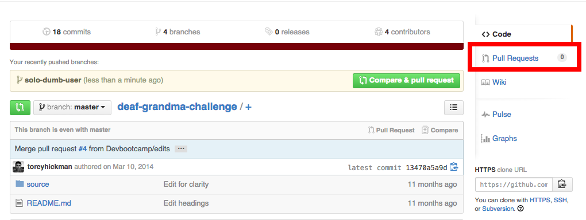
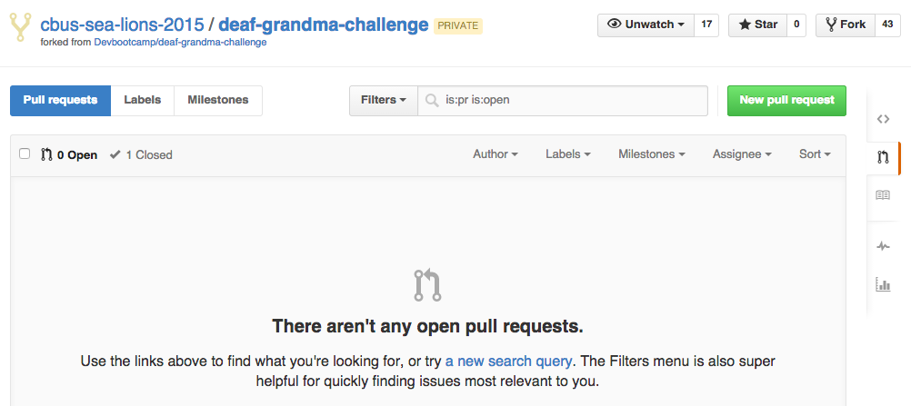
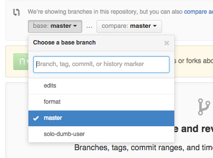
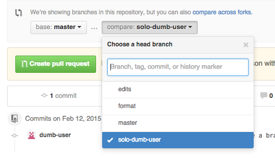
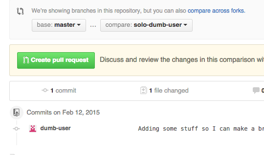
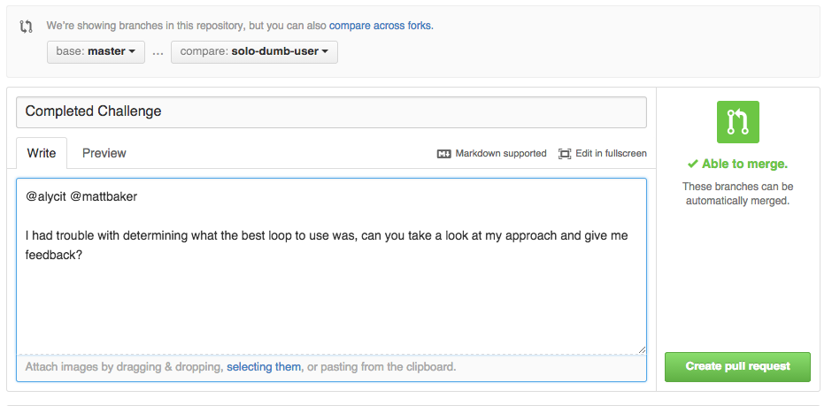
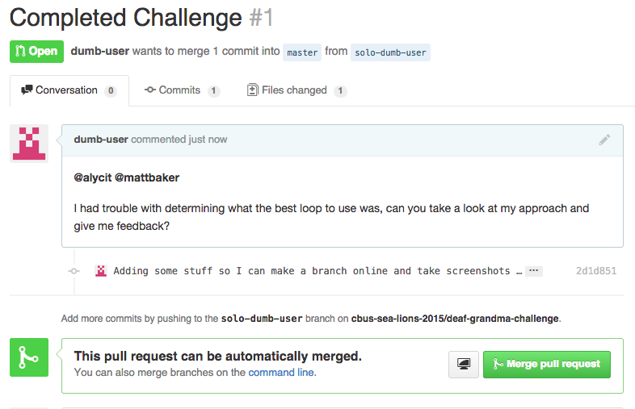
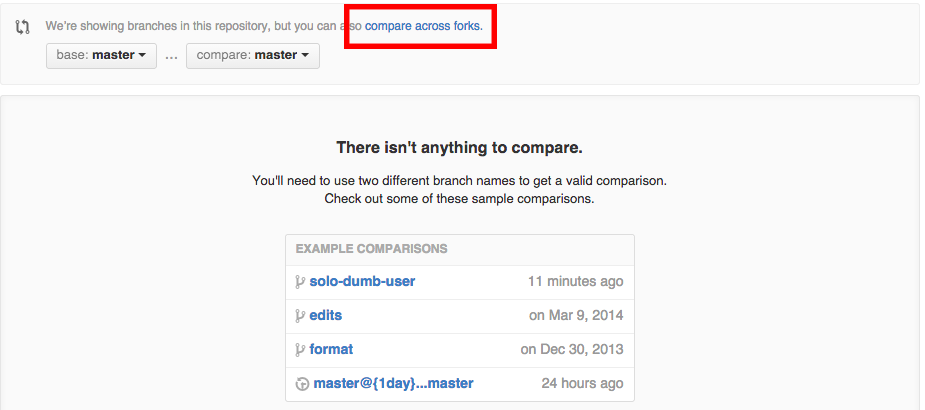
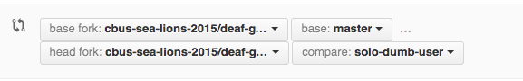

# Challenge / Github Workflow

### On Day One only each person in the cohort should do the following:
  1. Go to your image in the top right of github page and open the drop down menu.
  - Select 'Settings' from the dropdown.
  - In the Name field, please put your first and last name.
  - On the left navigation under 'Personal Settings', select 'Emails'
  - Make sure you have a primary email set.
  - Under 'Personal Settings', select 'Profile' and make sure your public email is set.

### We will be using github to submit and review all challenges. This is the standard workflows we will use.

1. Set your usernames at the command prompt on the laptop or workstation you are working on.

  For More than one student working on a challenge
  ```shell
  No Git User ~
  $ weare alycit mattbaker ltw

  Alyssa Diaz & Lucas Willett & Matt Baker ~
  $
  ```
  For Solo Work
  ```shell
  No Git User ~
  $ iam alycit

  Alyssa Diaz ~
  $
  ```
- Clone the challenge you plan to work on.

  *Note*: Use the https url on the DBC workstations.

  ```shell
  $ git clone https://github.com/Devbootcamp/cheering-mascot-challenge.git
  ```
- Create a branch using the following naming convention in the terminal.

  *Note*: The [pair-branch](https://github.com/Devbootcamp/pair-branch) utility can be installed from DBC.

  For Pairing
  ```shell

  # with the pair branch utility

  $ pair-branch
  Switched to a new branch 'pair-alycit,mattbaker,ltw'
  Ran the following command for you: git checkout -b "pair-alycit,mattbaker,ltw"

  # or manually

  $ git checkout -b "pair-github_username_1,github_username_2"
  # no spaces in between the quotation marks! and the comma is important"
  ```
  For Soloing
  ```shell
  $ git checkout -b "solo-github_username"
  # no spaces in between the quotation marks!"
  ```
- (**OPTIONAL**) Do your first push to git before you start working! This will help make sure you branch first and aren't working in master.  It will help prevent accidentally pushing to master.

  ```shell
  $ git push origin pair-github_username_1,github_username_2
  ```
  or
  ```shell
  $ git push origin solo-github_username
  ```
- Work on the challenge with your pair
- **Commit and push often**

  ```shell
  $ git add filename
  $ git commit -m "added test code"
  ```
- When finished, make sure all of your code is committed and do a final push of your branch.
- Go to the challenge on github.com and create a pull request.

  1. Navigate to the Pull Request View in the challenge over on the far right as shown below.
  
  - Click 'New Pull Request'
  
  - Select the proper branches in the dialog.
    - The master branch should be selected as the base. **Explicitly click it even though it looks like it's selected.**

    
    - Your branch should be selected as the compare. **Explicitly click it even though it looks like it's selected.**

    
    - Saying it again.  Even if it looks like the correct branches are already selected, please explicitly select and click them.  There seems to be a bug in these drop downs.
  - Click the Green 'Create Pull Request' Button
  
  - Give your pull request a good name and **enter comments only if you want a code review**.
    - To ask for a code review:

      Mention your instructors explicitly with what might have given you pause or what you might want feedback on as shown in the screen shot below.
    
  - Click the Green 'Create Pull Request' Button again.
  - This is something like what you will see.  DO NOT MERGE!
  

### Troubleshooting a Pull Request

If github keeps telling you there are no changes, don't panic!


Try these things:

- Go back to step 7.iii above.  Open the 'base' drop down and explicitly click the master branch.  Open the 'compare' or 'head' drop down and explicitly click your branch.

- Check the forks
  - Click 'compare across forks'.
  
  - Make sure the name of your corhort and 'master' are selected in the base fork drop downs, and the name of your cohort and 'your branch' are selected in the head fork.
  
